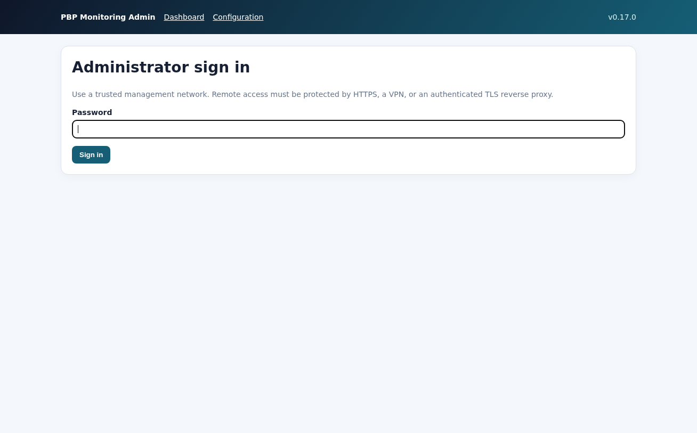

# Installation

Deploying the PAN-OS PBP monitoring collector on a Linux Docker host, from an
empty host to a first validated read-only API check.

Related pages: [Operations](operations.md) ·
[Incident report anatomy](reporting.md) ·
[Troubleshooting](troubleshooting.md) · [Back to the README](../README.md)

## 1. Prepare the host

Recommended platform:

- a dedicated Linux host or VM;
- Docker Engine with the Docker Compose plugin;
- connectivity from the firewall Syslog service route to host port 514;
- HTTPS connectivity from the Docker host to the PAN-OS management API;
- persistent storage for the two named Docker volumes;
- accurate host time through NTP.

Confirm Docker is available:

```bash
docker version
docker compose version
```

Clone the repository, then enter its directory. No configuration file needs to
be created:

```bash
git clone https://github.com/tbortolossi/panos-pbp-monitoring.git
cd panos-pbp-monitoring
docker compose config --quiet
docker compose build
docker compose up -d
docker compose ps
```

All three services must become `healthy`. The published host endpoints are then:

```text
0.0.0.0:514       TCP and UDP Syslog
0.0.0.0:8090      HTTP redirect to HTTPS
0.0.0.0:8088      HTTPS dashboard and administration
```

The Web ports are deliberately not `80` and `443`. Every service runs as an
unprivileged UID with all capabilities dropped, so nothing inside a container
can bind a port below 1024, and the defaults were chosen for a host where `80`,
`443`, `8080` and `8443` are already taken by something else. On a host where
the standard ports are free, publish them on the command line instead of
editing `compose.yaml`:

```bash
WEB_PORT=443 WEB_HTTP_PORT=80 docker compose up -d
```

`WEB_HTTPS_PUBLIC_PORT` is derived from `WEB_PORT`, so the HTTP redirect always
points at the HTTPS port actually published. Read the deployment's real mapping
from `docker compose ps` rather than assuming the defaults; the rest of this
page writes `8088` and `8090` for the default deployment.

The Web service always uses TLS. On first startup it creates an
installation-specific self-signed certificate and private key in the persistent
configuration volume. Remote administration, including initial password setup
and authenticated password changes, is enabled without a `.env` file. Restrict
both published Web ports to the trusted management network with the host
firewall or an upstream ACL; the first administrator setup is reachable
remotely but requires
the one-time setup code printed in the webui container log, so the collector
cannot be claimed by whoever reaches the port first:

```bash
docker compose logs webui | grep "setup code"
```

Failed sign-in and setup attempts are throttled per source address: after five
failures within fifteen minutes, that address must wait before trying again.

Opening `http://<docker-host>:8090` returns an HTTP 308 redirect to
`https://<docker-host>:8088`. The HTTP listener never serves the dashboard,
credentials, artifacts, or health data.

Open `https://<docker-host>:8088/admin`. The default certificate contains
`localhost` and `127.0.0.1`; a browser warning is therefore expected when the
service is first reached by another name or address. To generate the initial
certificate with the real management IP and DNS name, optionally set the SANs
for the first startup without creating `.env`:

```bash
WEB_TLS_HOSTNAMES=10.0.0.20,pbp-monitor.example.internal,localhost,127.0.0.1 \
docker compose up -d
```

Open `https://10.0.0.20:8088`. The certificate and private key are generated
once as `/config/web-tls.crt` and `/config/web-tls.key` in the persistent
configuration volume. Copy the public certificate over a trusted channel and
install it on the administration workstation to remove the browser warning and
protect against impersonation:

```bash
docker compose cp webui:/config/web-tls.crt ./pbp-monitoring-web.crt
```

Keep `web-tls.key` private. Changing `WEB_TLS_HOSTNAMES` does not replace an
existing certificate; remove or rotate the pair deliberately when its names
must change. HTTPS automatically marks the administrator session cookie
`Secure`.

To use an existing certificate instead, mount it through `certs/` and set
`WEB_TLS_CERT=/certs/web.crt` and `WEB_TLS_KEY=/certs/web.key`. Both values must
be supplied; otherwise startup fails closed.


## 2. Create the administrator




> Every screenshot in this repository is generated from a fictitious
> incident by `tools/generate_demo_stack.py`. No firewall, address, or
> serial shown is real.


Open `https://<docker-host>:8088/admin` and create a
password of at least 8 characters. The password is stored as a salted PBKDF2
verifier; the plaintext password is never stored.

An authenticated administrator can later change it in the configuration page.
The current password is required and all active administrator sessions are
invalidated after the change.

After the first authenticated sign-in, the admin page displays the installation
recovery key. Save it in a password manager or offline vault, then acknowledge
the backup in the page. It remains visible until acknowledgement and is not
rendered again afterwards. A CSV download is available before acknowledgement.

The key is generated once at first startup and persists across image rebuilds.
It is not generated during the Docker build. Anyone possessing both the
recovery key and `config.db` can decrypt the PAN-OS API keys, so treat it as a
privileged credential.

## 3. Add a firewall


In **Admin > Firewalls**, enter:

| Field | Description |
|---|---|
| Name | Stable local identifier, for example `PA-440`. Left blank, the PAN-OS hostname read from the firewall is used |
| Firewall IP | The firewall address, for example `192.0.2.10`. It is used both as the HTTPS API endpoint and as the allowed Syslog source |
| Authentication method | How the API key is obtained: username and password, an existing API key, or the stored key when editing |
| API key | Used by the *Existing API key* method |
| API username / API password | Used by the *Username and password* method; the password is never stored |
| TLS verify | Yes or No, per firewall; new firewalls default to No |
| Enabled | Whether the target participates in routing and collection |

Saving contacts the firewall once with `show system info`. That single read-only
call validates the API key and returns the device serial, hostname, model, and
PAN-OS version. All four are stored: the serial is what attributes a Syslog
message to this target and what the collector requires a log to carry before it
is accepted, and the hostname, model, and
version are shown in the **Device** column of the firewall list, so none of them
is typed by hand. The firewall must be reachable when the entry is saved: an
unreachable address, an untrusted certificate, or a rejected key is reported and
nothing is written.


### Keeping a saved firewall verified

A firewall is otherwise only contacted when an incident starts, so a revoked API
key, an address moved behind a new filter, or a deleted API administrator would
be discovered during an incident, exactly when evidence is being lost. The
collector therefore runs a small read-only check per enabled firewall every
`target_check_hours`, 24 by default, and 0 disables it:

- `show system info` for reachability, API key validity, and release drift;
- `show statistics` only when the stored dataplane core map is missing or was
  captured on a different model or PAN-OS release, refreshing it in place.

A firewall in steady state therefore costs one API call a day, and no capture
file is written. A firewall with an active incident is never checked: it is
already polled every few seconds while under packet-buffer pressure, and the
check must not compete with the diagnostic batches.

Each firewall card on the dashboard states the result of that check beside its
Syslog freshness, and turns amber while a monitoring run is in progress on that
firewall. The run state is read from the run files the collector already writes;
nothing polls the firewall to determine it.

The **Test** button beside each firewall runs the full read-only validation for
that firewall instead: every collection command and every parser, writing a
capture and an HTML report the dashboard already serves. The Web service mounts
the evidence volume read-only by design and the collector exposes no port, so
the button records the request in the shared configuration database and the
collector runs it on its next tick, a few seconds later. While a validation is
queued the configuration page reloads itself every five seconds so the outcome
appears without a manual refresh; it stops reloading as soon as no validation is
pending, and never reloads while a firewall form is open for editing. The
**Last check** column reports when either check last ran, whether it passed, and
a short reason when it did not.

Because HTTPS uses port 443 and Syslog uses port 514, one address covers both.
When an earlier configuration allowed additional Syslog sources for a target,
for example a PAN-OS service-route address, they are preserved on save and
listed under the form.

When temporary credentials are supplied, the Web service sends them by HTTPS
POST to PAN-OS key generation. They are never placed in the URL and the username
and password are not stored. The resulting API key is encrypted immediately.

Use a dedicated least-privilege XML API administrator. Prefer a management
certificate signed by an internal CA: copy its PEM bundle into `certs/` and set
**TLS verify** to *Yes*, with the container path of the bundle installed as the
system trust store. A per-firewall CA bundle path imported from a legacy
`targets.json`, for example `/certs/company-ca.pem`, is preserved and offered as
an extra choice in the list for that firewall.

New firewalls default to *No* for compatibility with self-signed management
certificates. Enable verification for production firewalls whenever possible;
the collector logs a warning whenever it is disabled.

## 4. Configure PAN-OS Syslog forwarding

The **PAN-OS Syslog forwarding** section of the configuration page renders this
whole block ready to paste, with the collector address already filled in from
the address the browser reached the page on, the Syslog port, and the name of
the log forwarding profile your security rules actually reference. Change any of
the three and the commands follow; **Download** saves the same block as a text
file for a change record. The page only produces text: the collector never
writes to PAN-OS.

The commands below are the same hierarchy, for reference. Replace
`<COLLECTOR_IP>` with the Linux Docker host address reachable from the firewall.
The following PAN-OS 12.2 CLI hierarchy creates the UDP/BSD server profile:

```text
configure
set shared log-settings syslog PBP-Docker server PBP-Docker server <COLLECTOR_IP>
set shared log-settings syslog PBP-Docker server PBP-Docker transport UDP
set shared log-settings syslog PBP-Docker server PBP-Docker port 514
set shared log-settings syslog PBP-Docker server PBP-Docker format BSD
set shared log-settings syslog PBP-Docker server PBP-Docker facility LOG_USER
```

When security rules already use the Log Forwarding Profile named `default`, add
dedicated match lists without replacing existing destinations or built-in
actions:

```text
set shared log-settings system match-list PBP-Docker filter "All Logs"
set shared log-settings system match-list PBP-Docker send-syslog [ PBP-Docker ]

set shared log-settings profiles default match-list PBP-Docker log-type threat
set shared log-settings profiles default match-list PBP-Docker filter "((threatid eq 8507) or (threatid eq 8508) or (threatid eq 8509))"
set shared log-settings profiles default match-list PBP-Docker send-syslog [ PBP-Docker ]
```

The System entry forwards ordinary System logs as well as early packet-buffer
congestion alerts. Ordinary logs make transport freshness observable without
creating an incident. The Threat entry sends only PBP IDs 8507–8509.

Confirm that existing security rules reference the intended profile:

```text
show rulebase security rules | match log-setting
show shared log-settings syslog PBP-Docker
show shared log-settings system
show shared log-settings profiles default
```

Commit only after reviewing the candidate configuration:

```text
commit description "Forward PBP System and Threat logs to the diagnostic collector"
```

A firewall must send Syslog from the same address configured as **Firewall IP**.
If a service route makes it send from a different source, the collector logs
`source not allowlisted` for that address.

## 5. Restrict the Linux host firewall

Allow port 514 only from the firewall management or Syslog service-route
addresses. Prefer an upstream network ACL. Docker creates its own forwarding
rules for published ports, so a generic UFW rule is not sufficient on every
host.

With Docker's iptables backend, place restrictions in `DOCKER-USER` before
Docker's accept rules. Traffic is already DNATed there, so the gateway's
container port is `1514`:

```bash
sudo iptables -I DOCKER-USER 1 -i <EXTERNAL_INTERFACE> -p udp -s <FIREWALL_SYSLOG_SOURCE> --dport 1514 -j ACCEPT
sudo iptables -I DOCKER-USER 2 -i <EXTERNAL_INTERFACE> -p udp --dport 1514 -j DROP
sudo iptables -I DOCKER-USER 3 -i <EXTERNAL_INTERFACE> -p tcp -s <FIREWALL_SYSLOG_SOURCE> --dport 1514 -j ACCEPT
sudo iptables -I DOCKER-USER 4 -i <EXTERNAL_INTERFACE> -p tcp --dport 1514 -j DROP
```

Adapt and persist the rules using the host's actual firewall backend. Review
[Docker's packet-filtering guidance](https://docs.docker.com/engine/network/firewall-iptables/)
before deployment. Plain UDP/TCP Syslog is not encrypted; use a protected
management network, VPN, or TLS-capable frontend when transport confidentiality
is needed.

## 6. Validate the installation

Check the listeners and service logs:

```bash
sudo ss -lunpt | grep ':514'
docker compose ps
docker compose logs --tail 100 collector syslog-gateway webui
```

Run one complete read-only PAN-OS API validation batch:

```bash
docker compose run --rm --no-deps collector \
  pbp-orchestrator --env-file /dev/null --check-api
```

The command returns success only when the configured targets, commands, and
required parsers validate. It writes evidence under each target's `api-checks`
directory.

Generate or wait for an ordinary PAN-OS System event, such as an authorized
administrator login. Confirm all of the following on the dashboard:

- **Syslog reception is active** is green globally;
- the corresponding firewall shows **receiving logs**;
- the event appears in **20 most recent received logs**;
- no diagnostic run starts for an ordinary non-PBP event.

Then wait for a genuine PBP event or use the controlled injection described
below. Never generate a flood to test the collector.

## Controlled lab trigger

The following injection starts behind the network-facing gateway. It validates
routing, trigger recognition, API collection, persistence, and reporting, but
does not prove the firewall-to-host UDP path:

```bash
docker compose exec -T syslog-gateway sh -c \
  "printf '%s\n' 'PBP_SYSLOG_SOURCE=<ALLOWED_SOURCE> <14>Packet buffer congestion is 50000/86016 (58%)(alert threshold is 50%).' | nc -u -w1 collector 5514"
```

Inspect the lifecycle:

```bash
docker compose logs --since 5m collector
docker compose exec collector find /data/targets -maxdepth 4 -type f
```

A trigger using an unconfigured source must be rejected before any PAN-OS API
call. That is expected allowlist behavior.

